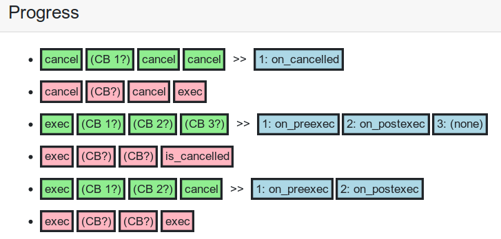
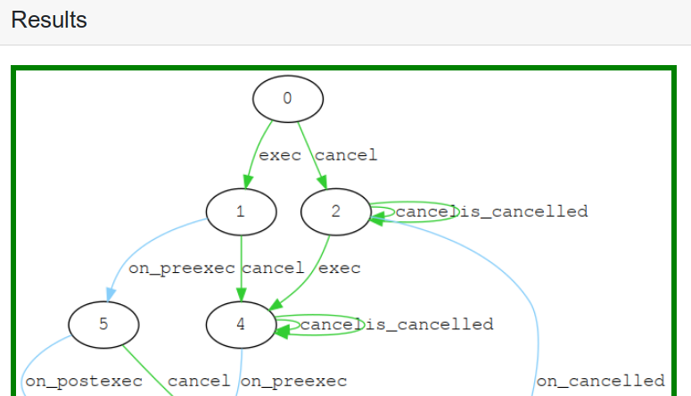

# Demo Tutorial

Begin by selecting an experiment from the blue dropdown menu.

Then, hit the green **Learn** button at the bottom of the
**LearningPurpose** panel.

## Following the learning process

Once the experiment is finished compiling and the learning process
begins, you will wonder how to read these things:

DroidStar learns by performing **queries**, which are sequences of
callins interspersed with pauses to listen for callbacks.  Each of
these lines represents the result of a single query.

These pauses are written in the traces as (CB?) blocks.  Each pause gets a blue response
block after the ">>", which either contains a callback or a (none) if none were seen.

Queries are **accepted** if running the callins in sequence does not
throw an error.  In this case they will appear green and followed by
(blue) callbacks.  If one of the callins throws an error, the query is
**rejected** and appears red in the log.

## Understanding the results

The result of a learning session is a **callback typestate**,
presented as a graph which describes a class's stateful behavior.

A class object begins in state 0, and allows only those callins which
have arrows leaving state 0 to be called.  Upon having an accepted
callin invoked, the object changes to the state indicated by the
callin's green arrow.

Somes states have a callback enabled, marked by a blue arrow.  This indicates that if you leave the
object in this state, you will observe that callback.

Callback typestates are built using query results.  Try looking back
through the query log that produced this result, and comparing queries
to the graph.  For accepted queries, you
will be able to create a path from the callins and callbacks in the
graph (where (none) makes no move).  For
rejected queries, you will find that one
callin in the sequence is applied in a state where it is not enabled
(there is no arrow labeled with it leaving the state).
